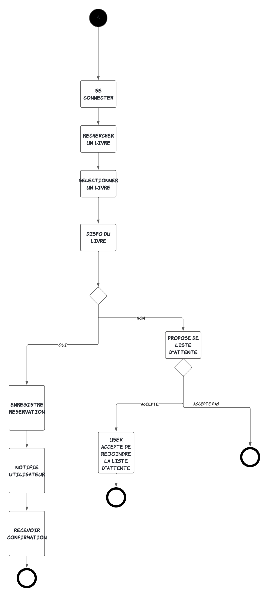

# Brief_bibliotheque

Ce projet vise à créer une application de gestion de bibliothèque, permettant aux utilisateurs de consulter le catalogue de livres, d'effectuer des emprunts et de gérer leur compte.

## Suivi du projet

Nous utilisons un tableau Trello pour suivre l'avancement des tâches et la répartition du travail. Vous pouvez consulter notre Trello en suivant ce lien : [Tableau Trello - Brief Bibliothèque](https://trello.com/b/kLo96FMp/brief-biblioth%C3%A8que)

## Maquettage et Prototypage

Nous avons réalisé le maquettage de l'application avec **Figma**. Le travail de maquettage inclut :

- La création et l'adaptation de six écrans de l'application à partir du document fourni.
- Une navigation fluide entre ces écrans, assurée par le prototypage Figma.
- La déclinaison de deux de ces écrans pour un usage desktop, en tenant compte des spécificités de ce support.

Vous pouvez consulter notre prototype Figma en suivant ce lien : [Prototype Figma - Brief Bibliothèque](https://www.figma.com/proto/GvldMFs3xORch0KtudJml4/Brief_biblioth%C3%A8que?node-id=0-1&t=mBNgiLTPginBv8jp-1)

## Parcours Utilisateur et Accessibilité

- Nous avons imaginé et conçu un **diagramme d'activité** représentant le parcours type d'un utilisateur souhaitant emprunter un livre, incluant chaque étape depuis la sélection du livre jusqu'à la confirmation de l'emprunt.
- Un des écrans a été optimisé selon les critères du **RGAA** (Référentiel Général d’Amélioration de l’Accessibilité) pour garantir une meilleure accessibilité.

Voici le diagramme UML représentant les interactions entre les entités de l'application :

